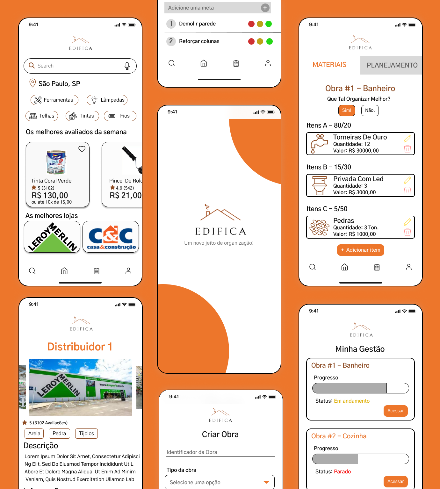

# Edifica Mobile 

## Descrição do Projeto

Edifica é uma plataforma inovadora para a gestão de obras e reformas, desenvolvida para tornar o processo de construção mais eficiente e organizado. Com um conjunto de funcionalidades abrangentes, nosso sistema facilita a busca e seleção de produtos, envolve distribuidores e descomplica a gestão da obra.

## Tecnologias Utilizadas

- **Flutter:** Utilizamos o Flutter como framework principal para o desenvolvimento da parte mobile do projeto. O Flutter oferece uma maneira eficiente e rápida de criar aplicativos móveis multiplataforma com uma única base de código.

- **Dart:** O Dart é a linguagem de programação utilizada pelo Flutter. É uma linguagem orientada a objetos e de alto desempenho que é otimizada para desenvolvimento de aplicativos móveis. O Flutter e o Dart trabalham em conjunto para oferecer uma combinação poderosa, permitindo interfaces de usuário elegantes e funcionalidades avançadas com facilidade.

- **Widgets Personalizados:** O Flutter oferece uma vasta biblioteca de widgets personalizáveis que permitem a criação de interfaces de usuário exclusivas e altamente interativas. Esses widgets são altamente flexíveis e podem ser personalizados para atender às necessidades específicas do projeto.

- **Hot Reload:** O Hot Reload ver as mudanças em tempo real à medida que fazemos alterações no código. Isso acelera significativamente o processo de desenvolvimento, tornando-o mais iterativo e eficiente.

## Prototipação

Utilizamos o Figma para desenvolver toda a prototipação do nosso projeto, aqui estão algumas das telas prototipadas:

